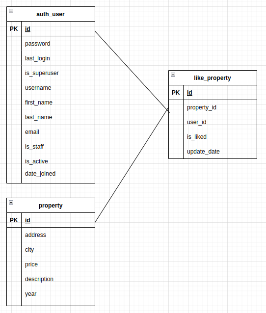

# Prueba tuHabi 
El proyecto se desarrolla como una arquitectura de microservicios, esto con el fin de tener servicios independientes, ligeras e implementables cada con su propio objetivo dentro de la aplicación general.
Las herramientas utilizadas son:
```
mysql-connector-python==8.0.31
python-dotenv==0.21.0
uvicorn==0.20.0
```

Primero iniciaré configurando las librerías necesarias. Realizaré una estructura de carpetas que permita tener ordenado el codigo, de manera que pueda ser modular.
Posteriormente realizaré la configuración a la base de datos, haŕe algunas pruebas de conexión.
Una vez que ya tenga configurada la conexión a la base de datos, crearé la consulta SQL para poder filtrar de acuerdo a la solicitud del usuario y con ello crearé las primeras pruebas unitarias, para ir comprobando los resultados obtenidos con los resultados esperados.

## Servicio "Me gusta"
Para este servicio propongo generar una tabla la cual este relacionada con la tabla de usuarios e inmuebles, además de agregar un campo de fecha, donde se guardara la fecha en que le dio "me gusta" a un inmueble, y el campo de "me_gusta", esto con el objetivo de que si ya no le gustará un inmueble se cambiaría el estado de dicho campo para no tener que borrar el registro. También se actualizaría la fecha, para poder filtrar por la fecha más reciente.

```
CREATE TABLE like_property(
    id int NOT NULL AUTO_INCREMENT,
    user_id int NOT NULL,
    property_id int NOT NULL,
    is_liked int,
    update_date datetime NOT NULL DEFAULT CURRENT_TIMESTAMP,
    PRIMARY KEY (id),
    CONSTRAINT like_property_user_id_fk FOREIGN KEY user_id REFERENCES auth_user(id),
    CONSTRAINT like_property_property_id_fk FOREIGN KEY property_id REFERENCES property(id)
)

```



